# 0602 - 깃허브액션 워크플로 이벤트 트리거 변경
REF: https://hyperconnect.github.io/2021/06/14/auto-deployment.html

REF - 공홈가이드 : https://docs.github.com/ko/github-ae@latest/actions/using-workflows/events-that-trigger-workflows

<br><br>

## 1. 
before docker-image.yml
```yml
name: Build and Deploy

on:
  push:
    branches:
      - main

jobs:
  build-and-deploy:
    runs-on: ubuntu-latest

    steps:
      - name: Checkout repository
        uses: actions/checkout@v2
```


after docker-image.yml
```yml
name: Build and Deploy

on:
  push:
    branches:
      - main

jobs:
  build-and-deploy:
    runs-on: ubuntu-latest

    steps:
      - name: Checkout repository
        uses: actions/checkout@v2
```

## 2. MERGE PR 규칙 설정
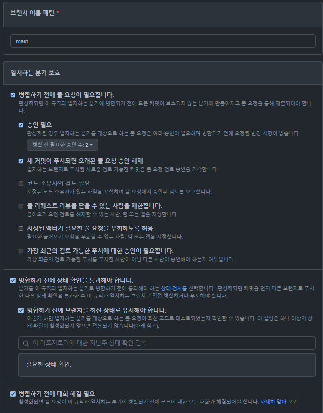
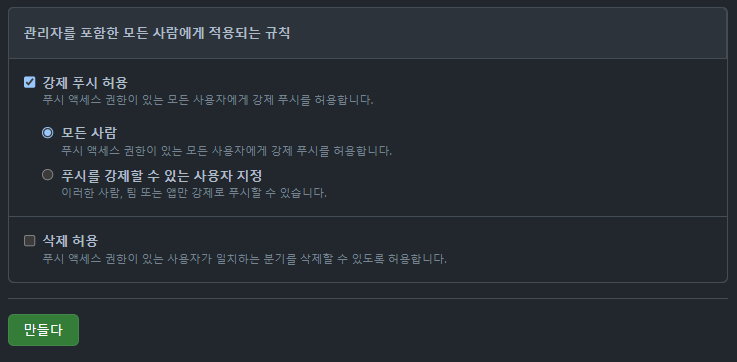

## 3-1. workflow 규칙수정 1
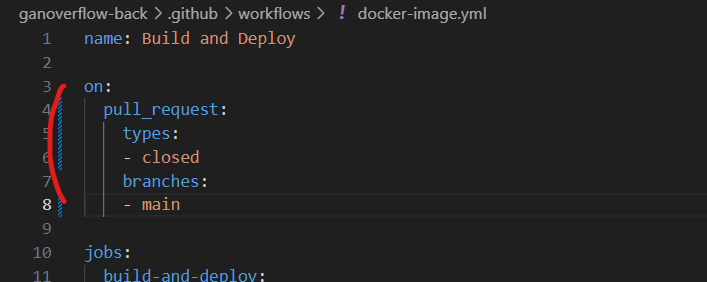

## 3-1. workflow 규칙수정 2
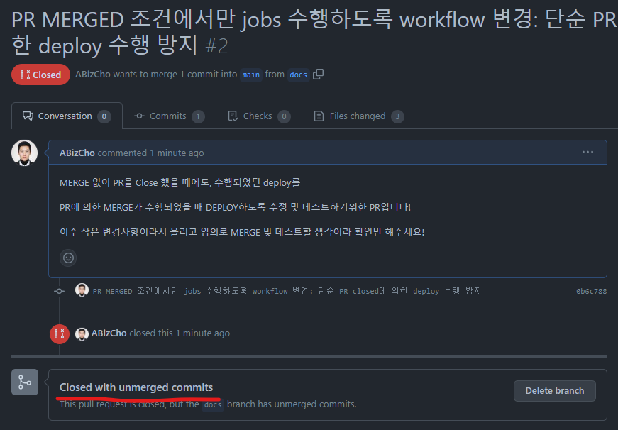
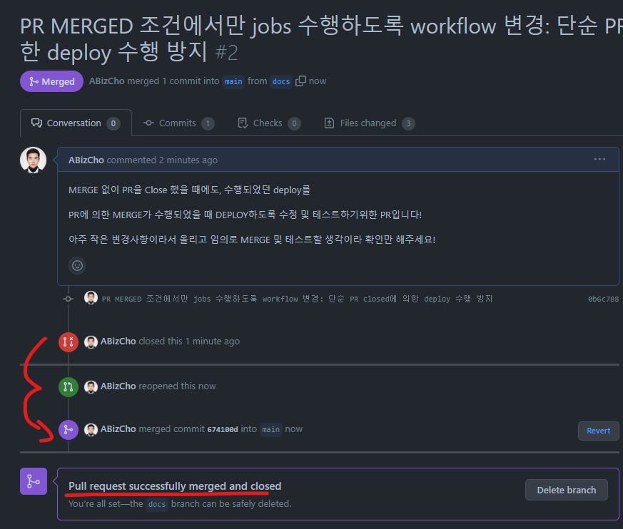
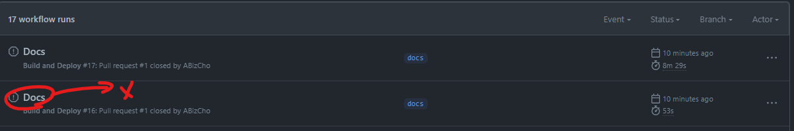

## 3-1. workflow 규칙수정 3 - 완료
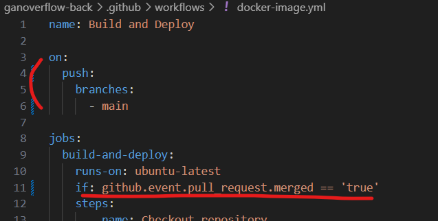
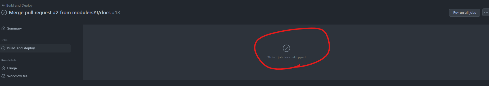
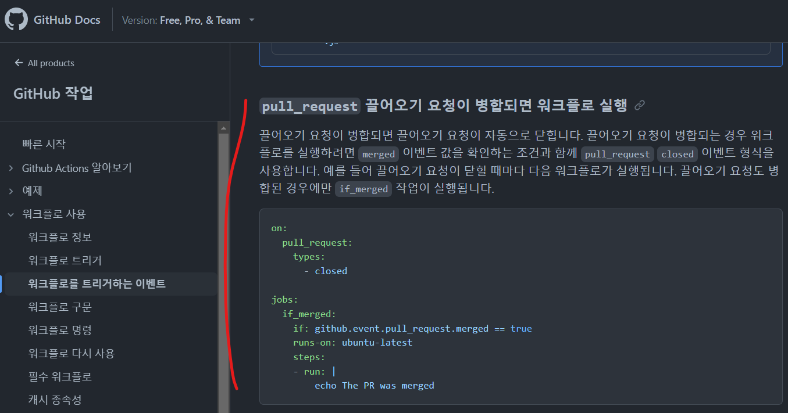
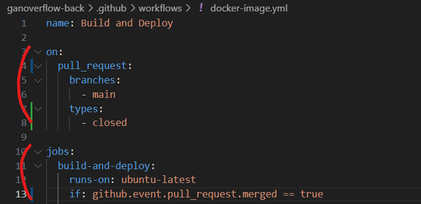
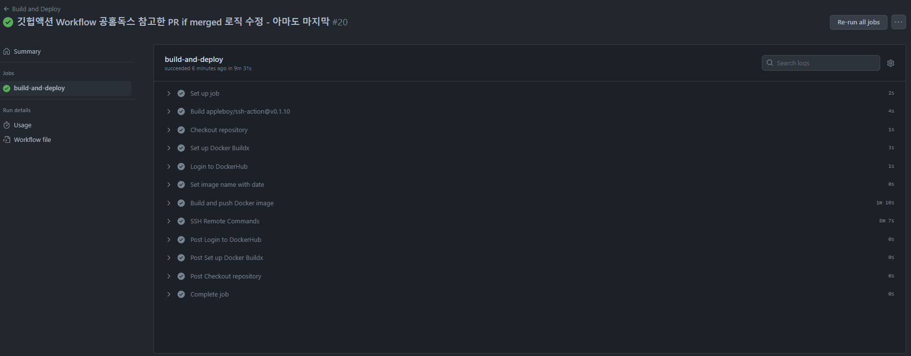